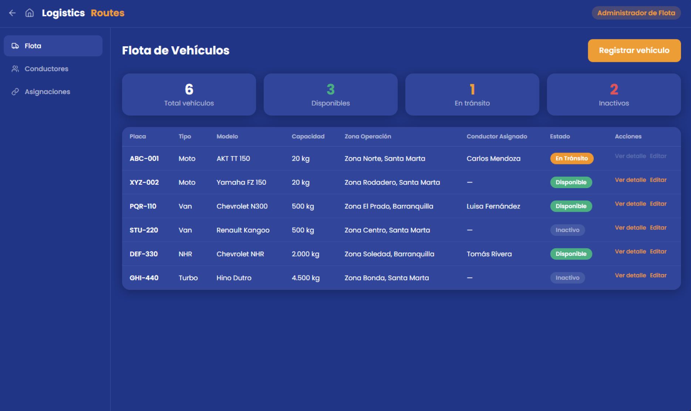

# Prototipo de Baja Resolución — Módulo 2: Gestión de Rutas
 
**Herramienta:** Figma  
**Enlace:** [Ver prototipo en Figma](https://www.figma.com/design/m9Qn71TXaujiT3xg5fELz0/Prototipo-Sistema-gesti%C3%B3n-de-rutas---M2?node-id=0-1&t=sjBLhx1FMVNrz9yL-1)
 
El prototipo cubre los flujos principales del sistema para los tres actores del módulo: Despachador Logístico, Conductor y Administrador de Flota. Su propósito es validar la estructura de navegación y la distribución de información en cada pantalla, sin representar implementación funcional.
 
**IMÁGENES:**

### #1 — Home

---

### #2 — Vista Despachador

---

### #2.1 — Detalle de Ruta

---

### #2.2 — Confirmación de Despacho

---

### #3 — Vista Conductor *(vista móvil)*

  

---

### #3.1 — Gestión de Parada *(vista móvil)*

  

---

### #4 — Vista Administrador de Flota
