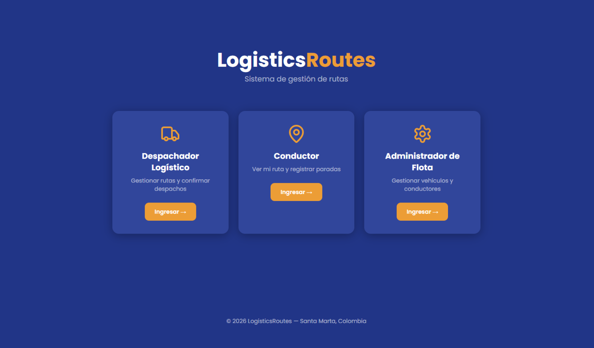
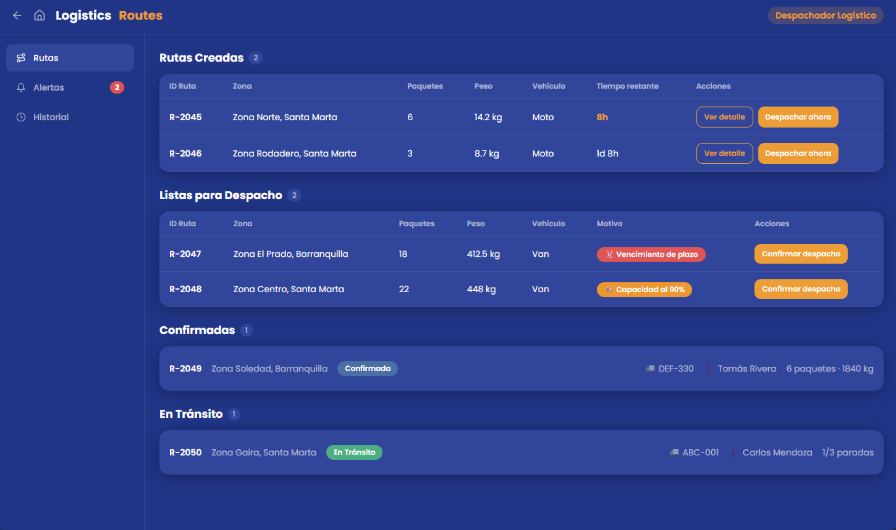
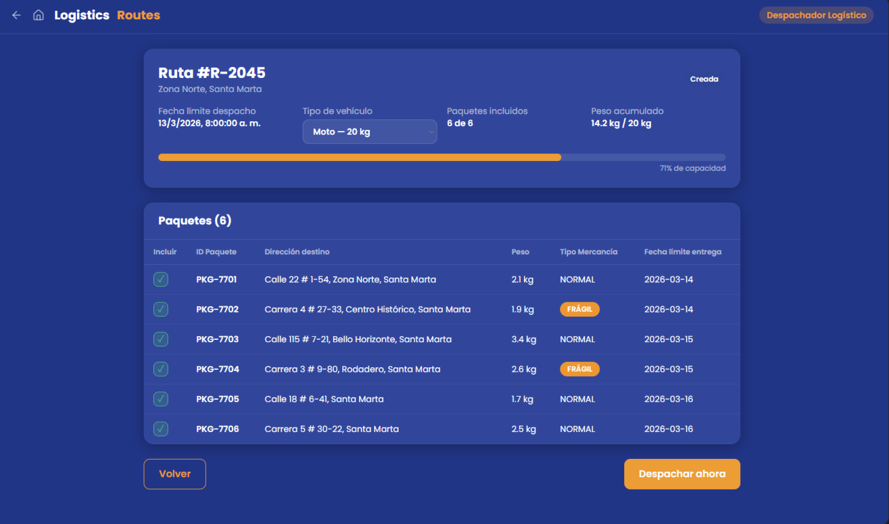
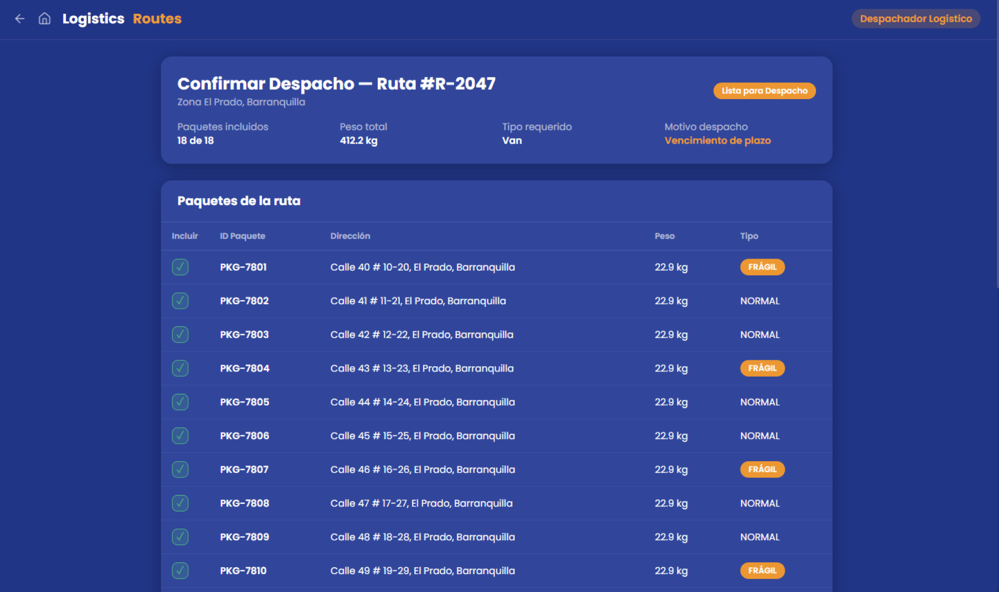
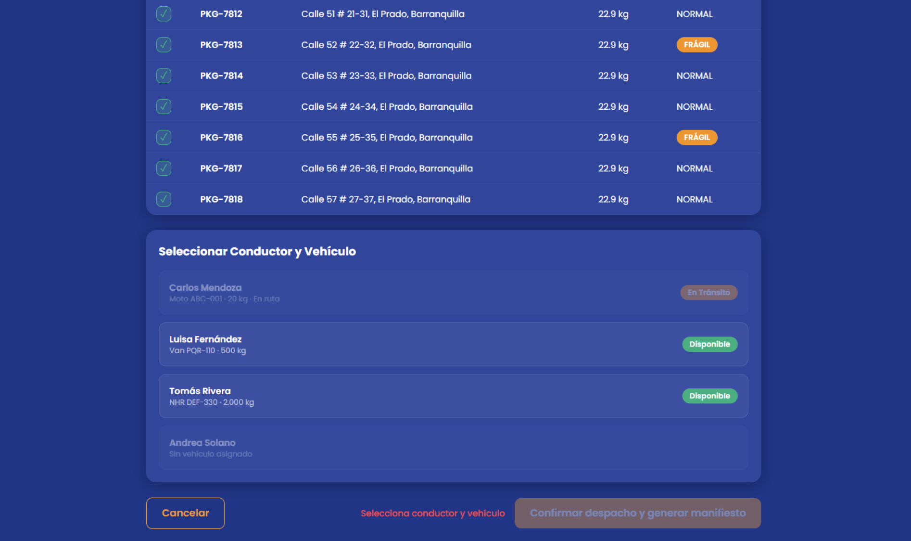
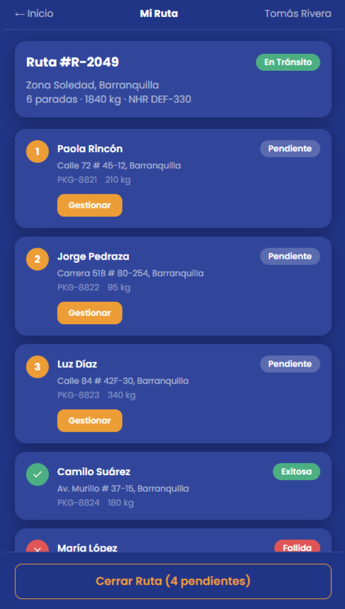
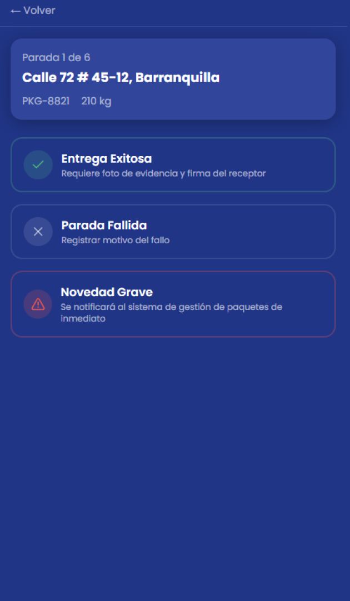

# Prototipo de Baja Resolución — Módulo 2: Gestión de Rutas
 
**Herramienta:** Figma  
**Enlace:** [Ver prototipo en Figma](https://www.figma.com/design/m9Qn71TXaujiT3xg5fELz0/Prototipo-Sistema-gesti%C3%B3n-de-rutas---M2?node-id=0-1&t=sjBLhx1FMVNrz9yL-1)
 
El prototipo cubre los flujos principales del sistema para los tres actores del módulo: Despachador Logístico, Conductor y Administrador de Flota. Su propósito es validar la estructura de navegación y la distribución de información en cada pantalla, sin representar implementación funcional.
 
**IMAGENES:**

#1 

#2

#2.1

#2.2

#3

#3.1

#4
